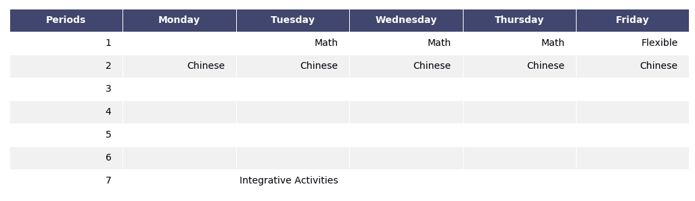
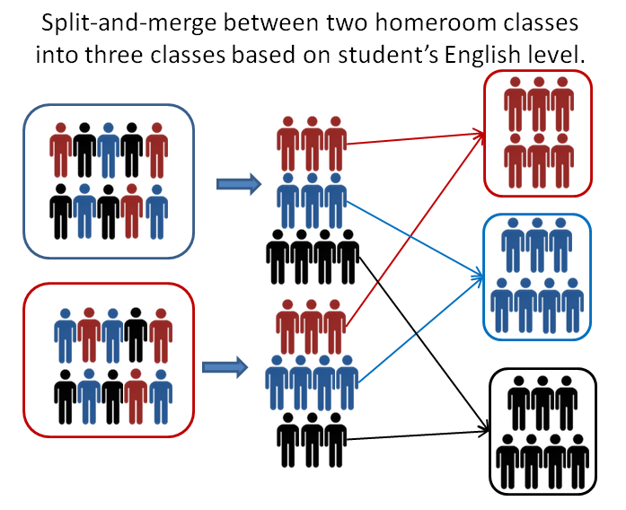
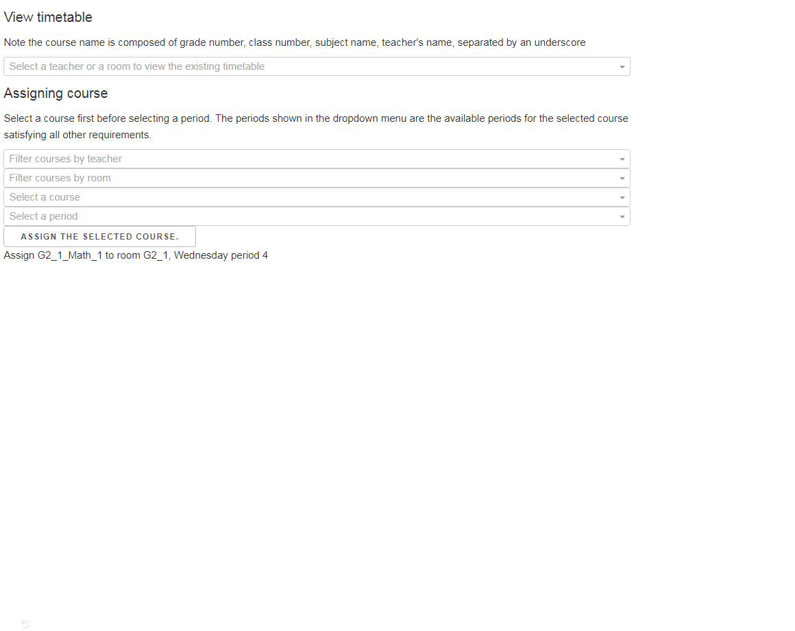

# Course scheduling for Taiwanese schools
## Summary
This repository contains a software for automatic course scheduling with constraints
specific to Taiwanese schools. The software is applied to a real-world course scheduling problem with
994 courses, 66 teachers and 49 rooms and reduced the scheduling time from two weeks of 
manual planning to minutes.

## Motivation
There are software designed for course scheduling but, to my knowledge, none of them are robust enough to satisfy the 
scheduling requirements of Taiwanese 
schools. Instead, the school I worked with had to do manual scheduling that takes more than 2 weeks and often some
of the scheduling requirements are ignored so that the scheduler don't have to frequently re-schedule the timetables. 
Motivated to solve this difficulty, I have designed a course schduling software specifically for Taiwanese schools.

## Introduction
This repository constains scripts for solveing a course scheduling problem for an elementary school in Taiwan. The framework 
can also be used to solve the teacher assignment problem simultaneously. 

The scheduling problem for Taiwanese school is a highly constrained problem. In Taiwanese education system, 
students are assigned into homerooms classes (e.g. grade 3 class 5) and each homeroom class 
needs to be assigned a range of subjects (Chinese, English, Math, etc). There are regulations on 
the number of periods (time slots) that should be taught a week for each subject and for each grade. E.g. grade 6 students 
should receive 5 Chinese classes a week.

For clarity, I will use **course** to represent a class of a 
certain subject for a certain grade with a homeroom number and a class index. 
For example, a Math class for grade 5 homeroom 3 with class index 1
would be referred to as a course and another Math class for the same grade, same homeroom but 
a different class index would referred to as another course. See script **BaseModel.py** for more details.

## Constraints considered
The scheduling constraints considered in this program include:
- Teachers' availability at certain periods. These includes teachers' preferences. These preferences 
are usually sacrificed by manual scheduling due to scheduling complexity and time availability.
- Total number of periods assigned to a teacher.
- Homeroom availability for classes taught at homeroom
- Subject room availability for classes taught at subject room (e.g. science room).
- Some courses need to happen at the same period so that some students from differet homerooms can attend alternative
courses designed for their needs. 
- Some courses need to be taught in consecutive periods. 
- Some courses are restrained in/from certain periods. 
- Some courses of the same subject needs to be at least two days apart (or one day apart 
if one of the courses is scheduled in Wednesday).
- Split-and-merge between two or more homeroom classes: 
some English classes split a homeroom students into two or three groups by students' English abilities.
The splited groups from individual homerooms are merged with the groups from other homerooms to form 
another class.



## Basic scheduling strategy
- Define operations for assigning and removing courses from a certain time slot and for certain room. 
Note that special operations are needed to handle various constraints. These operations are
defined in **BaseModel.py**.

- Sequencially add in/removing batches of courses using large neibourhood search. Highly constrained courses are 
scheduled first and only when the current batch of courses are schduled the algorithm begin to schedule the next 
batch. If assigning all courses for a given batch was not achieved under 2000 iteration, then all previously
assigned courses are removed and the algorithm restarts. See **solving_zhes_using_sequential_LNS.py** for more information.

## Solution output
Schedules (timetables) for each teacher and each room are written in "timetable/teacher_tb.xlsx" 
and "timetable/rooms.xlsx", respectively. A copy of the solution in base classes is saved in a pickle file, "status.pkl".

## Scripts
- **zhes_scheduling_problem.py** defines the inputs for the scheduling problem. The
problem consists of 994 courses, 66 teachers and 49 rooms.

- **solving_zhes_using_sequential_LNS.py** is the main scrip to run to solve the scheduling problem and outputs a 
pickled solution file **status.pkl**

- **CourseScheduling.py** contains the large neibourhood algorithm for solving the problem. 

- **scoring.py** defines the penalty for violating the requirements or preferences. 
Violation of strict requirement would incur high penalty score while violation of 
preferences would only lead to low violation score.

- **CourseSearch.py** contains functions for (semi-manual) fine tuning the schedule. 
These functions will derive the feasibility or the change of scores for fine tuning the courses.
The functions can also be used as base functions for other heuristic methods such as tabu search.

- **PostSolution.py** contains functions for checking requirements and for output the 
schedules in **.xlsx** format and pickle format.

- **course_scheduling_app.py** can be used to deploy a dash application for course
scheduling. The prototype will automatically derive the feasible periods for a course selected.
Hence doing manual course scheduling in the app is straight forward since you don't have to 
manually check constraints and find out all the feasible periods. The prototype was for illustration 
only and the functionalities was not fully developed.



# Running the scripts
Use the following command to solve the scheduling problem:
```python
python solving_zhes_using_sequential_LNS.py
```
